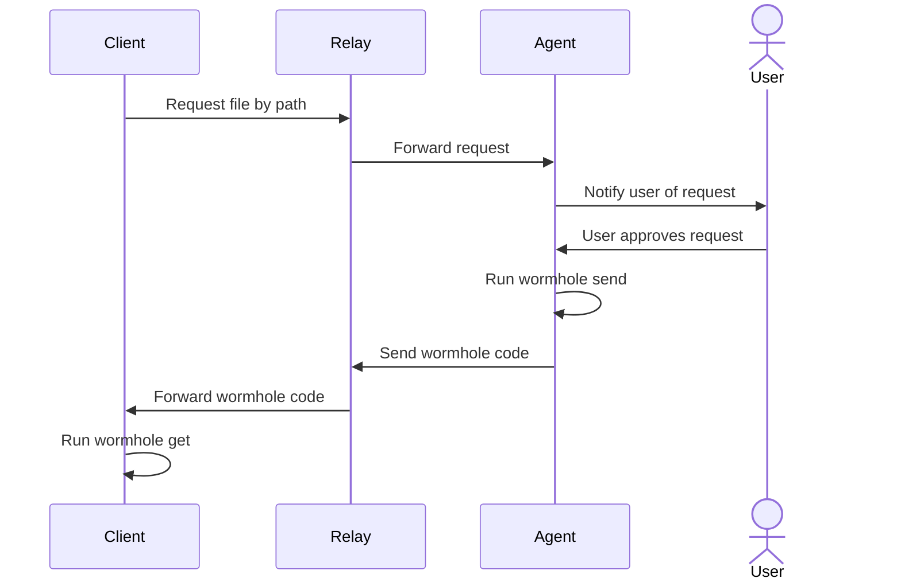

# holeworm 🪱

Inverse [magic-wormhole](https://github.com/magic-wormhole/magic-wormhole), host 1 request a path, host 2 grants access to it.
A relay server in the middle forwards wormhole codes and runs wormhole get/send on behalf of the two hosts.

## Usage

1. Install client and agent on respective machines (TBD).
2. Run `holeworm get /etc/passwd --relay <relay-url> --agent-id <agent-id>` on the client machine.
3. Accept notification on the agent machine.
4. File is transferred using magic-wormhole.

## Modules

- `holeworm/relay`: relay server
- `holeworm/client`: client to request a file
- `holeworm/agent`: receives file request and grants access
- `holeworm/common`: shared code between modules

### Relay

Uses a SQLite database to store data necessary to act as a relay.   
Emits server sent events to the **agent** when a client requests a file.   
Emits server sent events to the **client** when the agent sends a wormhole code. 

### Client

Requests a file by path from the relay.
Waits for a wormhole code from the relay.
Runs `wormhole get` with the received code.
Closes the connection to the relay when done.

### Agent

Waits for file requests from the relay.
Notifies the user of the request using the operating system's notification system.
When the user approves the request, runs `wormhole send` with the requested path.
Keeps the connection to the relay indefinitely open to receive new requests.

The agent initializes itself with a public/private key pair to authenticate with the relay.
The agent id is a short unique id that is linked with the client using the key pair.

