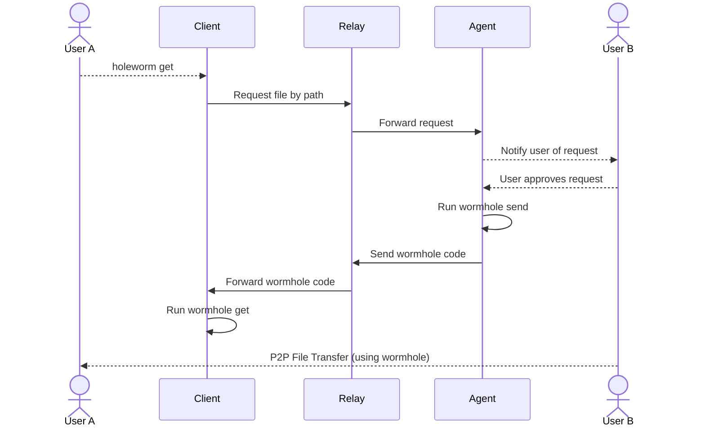

# holeworm 🪱

Inverse [magic-wormhole](https://github.com/magic-wormhole/magic-wormhole), host 1 request a path, host 2 grants access to it from notification service.
A relay server in the middle forwards wormhole codes and runs wormhole get/send on behalf of the two hosts.

## Usage

1. Install client and agent on respective machines (TBD).
2. Run `holeworm get /etc/passwd --relay <relay-url> --agent-id <agent-id>` on the client machine.
3. Accept notification on the agent machine.
4. File is transferred using magic-wormhole.

## Modules

- `holeworm/relay`: relay server
- `holeworm/client`: client to request a file
- `holeworm/agent`: receives file request and grants access
- `holeworm/common`: shared code between modules
- `holeworm/cli`: command line interface



### Relay

Uses a SQLite database to store data necessary to act as a relay.   
Emits server sent events to the **agent** when a client requests a file.   
Emits server sent events to the **client** when the agent sends a wormhole code. 

### Client

Requests a file by path from the relay.
Waits for a wormhole code from the relay.
Runs `wormhole get` with the received code.
Closes the connection to the relay when done.

### Agent

Waits for file requests from the relay.
Notifies the user of the request using the operating system's notification system.
When the user approves the request, runs `wormhole send` with the requested path.
Keeps the connection to the relay indefinitely open to receive new requests.

The agent initializes itself with a public/private key pair to authenticate with the relay.
The agent id is a short unique id that is linked with the client using the key pair.

### CLI

The CLI (`holeworm` command) allows the user to run client and agent commands.

#### Download subcommands

```bash
holeworm download <module>
```

Where `<module>` is one of `relay`, `client`, or `agent`.
Each module is built as a standalone binary, including the boostrap `holeworm` command.

```bash
for os in linux darwin windows; do
  for arch in amd64 arm64; do
    GOOS=$os GOARCH=$arch go build -o dist/$os-$arch/relay ./relay/cmd
    GOOS=$os GOARCH=$arch go build -o dist/$os-$arch/client ./client/cmd
    GOOS=$os GOARCH=$arch go build -o dist/$os-$arch/agent ./agent/cmd
  done
done
```

The `holeworm` command will fetch the appropriate binary for your OS and architecture from Github releases
and puts it in `~/.holeworm/bin/`.

The bootstrap command can be installed in `/usr/local/bin`, so you don't have modify your PATH.

#### Agent Commands

Install subcommand:

```bash
holeworm download agent
```

```bash
holeworm agent init --relay <relay-url>
``` 

Initializes the agent, generates a key pair and registers with the relay.
Some data is stored in `~/.holeworm/`, including:

```
privkey.pem  # private key
pubkey.pem   # public key
config.json  # contains agent id and relay url
```

The command outputs the agent id, which is needed by the client to request files.
If you lose the agent id, run the command again to get it.

```bash
holeworm agent id
``` 

To debug, run this command to receive a log feed:

```bash
holeworm agent log 
```

#### Client Commands

```bash
holeworm get <path>
```

Requests a file by path from the relay specified in `~/.holeworm/config.json`.


